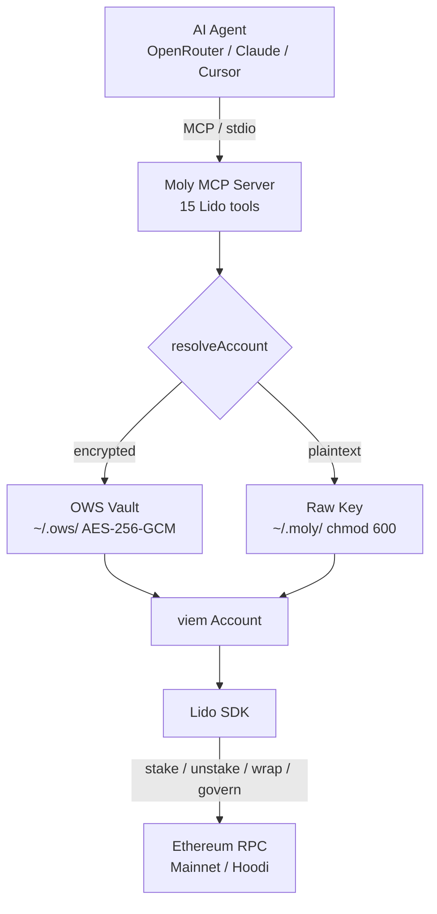

# Moly — Lido for AI Agents

[](https://github.com/daiwikmh/moly)

A complete platform for AI agents to interact with the [Lido](https://lido.fi) liquid staking protocol. Stake ETH, manage withdrawals, wrap/unwrap stETH, and vote on governance — all from natural language.

> **Source code:** [github.com/daiwikmh/moly](https://github.com/daiwikmh/moly)

**Three ways to use it:**

| | What | For who |
|---|---|---|
| [`@moly-mcp/lido`](#-cli-package-molylido) | `npx @moly-mcp/lido` — zero-config MCP server | Any developer with Claude Desktop, Cursor, or Windsurf |
| [MCP Server](#-mcp-server-stdio) | Bun-based stdio MCP server (13 tools) | Developers embedding Lido in custom agent setups |
| [Dashboard](#-dashboard) | Next.js agentic chat UI with dual MCP interface | End users who want a web interface |

---

## Features

### Dual MCP Architecture

The dashboard serves as **both** a web application **and** an MCP server simultaneously:

- **Web Chat** (`/api/chat`) — Users interact with Lido through a conversational AI powered by OpenRouter
- **MCP Endpoint** (`/api/mcp`) — External AI agents (Claude Desktop, Cursor, etc.) connect to the same 13 Lido tools via the Model Context Protocol over HTTP
- **Shared Backend** — Both interfaces use the identical tool functions in [`lib/lido.ts`](https://github.com/daiwikmh/moly/blob/main/moly/lib/lido.ts), so behavior is always consistent
- **Header-based Config** — The MCP endpoint reads `x-lido-mode`, `x-lido-network`, and `x-lido-chain` headers to configure per-request behavior
- **Discovery** — `GET /api/mcp` returns a JSON manifest listing all 13 tools, configuration options, and a quickstart guide

> This means a developer can point Claude Desktop at the running dashboard AND use the web UI at the same time — both hit the same Lido tools.

### Two Independent Toggles

Mode and Network are fully independent — you can simulate on mainnet or go live on testnet:

| Toggle | Options | What it controls |
|---|---|---|
| **Mode** | Simulation / Live | Simulation = all writes are dry-run. Live = real transactions (MCP server with private key only) |
| **Network** | Hoodi Testnet / Ethereum Mainnet | Which chain to connect to. RPC, contract addresses, and chain ID switch automatically |

- Visual indicators: pulsing yellow dot for testnet, green for mainnet
- Config changes mid-conversation inject a system message so the AI knows the context shifted
- Both toggles persist across chat messages

### Agentic Chat Interface

- **Streaming AI responses** with tool invocations rendered inline
- **Structured tool result cards** — balances show as 3-column grids, proposals render with status badges and vote bars, simulations show gas estimates with explanatory notes
- **4 suggested prompts** on empty state: check Vitalik's balance, simulate staking, show governance proposals, check conversion rate
- **5-step tool chaining** — the AI can call up to 5 tools sequentially to answer complex queries
- **12-second timeout** per tool with safe error wrapping — a failing tool never crashes the stream

### OWS Integration

Built-in support for the [Open Wallet Standard](https://openwallet.sh) as a secure key backend:

- **Encrypted vault** — private keys stored in `~/.ows/wallets/` with AES-256-GCM encryption at rest
- **Zero key exposure** — keys decrypted only at signing time, never visible to agents or LLMs
- **Multi-wallet** — named wallets, pick which one to use during setup
- **Fallback** — raw private key (chmod 600) still supported for quick setups
- **Optional dependency** — OWS is not required, install only if you want encrypted key storage

### In-App Documentation

19+ pages of docs served at `/docs` with:

- 7 sections: Getting Started, MCP Server, Dashboard, Tools Reference, Guides, Reference, CLI Package
- Code blocks with **copy-to-clipboard** button (appears on hover)
- Responsive sidebar navigation with current page highlighting
- Prev/Next page navigation
- Callout boxes (info, warning, tip)
- Code samples for Anthropic API, Vercel AI SDK, and MCP SDK TypeScript

---

## CLI Package (`@moly-mcp/lido`)

The fastest way to get started. Runs an interactive setup wizard on first launch, stores config locally (`~/.moly/config.json` with chmod 600), and starts a stdio MCP server.

```bash
npx @moly-mcp/lido
```

The wizard asks for:
1. **Network** — Hoodi Testnet or Ethereum Mainnet
2. **Custom RPC** — optional, defaults to public RPCs
3. **Mode** — Simulation (dry-run) or Live (real transactions)
4. **Key source** — OWS Wallet (encrypted via [Open Wallet Standard](https://openwallet.sh)), raw private key (chmod 600), or skip
5. **AI Provider** — Claude, Gemini, or OpenRouter with model selection

### Commands

| Command | Description |
|---|---|
| `npx @moly-mcp/lido` | First run: wizard then server. After: server directly |
| `moly setup` | Re-run the full setup wizard |
| `moly config` | Print current config (keys redacted) |
| `moly reset` | Delete config and start fresh |
| `npx @moly-mcp/lido --server` | Force-start MCP server (use in AI client configs) |

### AI Client Integration

Add to your MCP client config (Claude Desktop, Cursor, Windsurf):
```json
{
  "mcpServers": {
    "moly": { "command": "npx", "args": ["@moly-mcp/lido", "--server"] }
  }
}
```

> **Source:** [`cli/`](https://github.com/daiwikmh/moly/tree/main/moly/cli) — [`bin.ts`](https://github.com/daiwikmh/moly/blob/main/moly/cli/src/bin.ts), [`wizard.ts`](https://github.com/daiwikmh/moly/blob/main/moly/cli/src/setup/wizard.ts), [`server/index.ts`](https://github.com/daiwikmh/moly/blob/main/moly/cli/src/server/index.ts), [`tools/`](https://github.com/daiwikmh/moly/tree/main/moly/cli/src/tools)

---

## MCP Server (stdio)

Standalone Bun-based MCP server for embedding in custom agent setups. Reads config from environment variables.

```bash
cd mcp
cp .env.example .env
# Set PRIVATE_KEY, LIDO_MODE (simulation|live)
bun install && bun run dev
```

### Config for AI Clients

```json
{
  "mcpServers": {
    "lido": {
      "command": "bun",
      "args": ["run", "/path/to/moly/mcp/src/index.ts"],
      "env": {
        "LIDO_MODE": "simulation",
        "PRIVATE_KEY": "0x..."
      }
    }
  }
}
```

> **Source:** [`mcp/`](https://github.com/daiwikmh/moly/tree/main/moly/mcp) — [`index.ts`](https://github.com/daiwikmh/moly/blob/main/moly/mcp/src/index.ts), [`tools/`](https://github.com/daiwikmh/moly/tree/main/moly/mcp/src/tools)

---

## Dashboard

Next.js agentic chat UI with dual MCP architecture. Serves as both a web chat interface and an MCP-over-HTTP endpoint (`/api/mcp`) simultaneously.

```bash
cp .env.example .env.local
# Add OPENROUTER_API_KEY
bun install && bun run dev
```

Open http://localhost:3000

---

## Tools (15 total)

All three packages expose the same Lido toolset. The CLI package adds 2 settings tools.

### Read Tools

| Tool | Description | Source |
|---|---|---|
| `get_balance` | ETH, stETH, wstETH balances for any address | [`balance.ts`](https://github.com/daiwikmh/moly/blob/main/moly/cli/src/tools/balance.ts) |
| `get_rewards` | Staking reward history over N days | [`balance.ts`](https://github.com/daiwikmh/moly/blob/main/moly/cli/src/tools/balance.ts) |
| `get_conversion_rate` | Current stETH / wstETH exchange rate | [`wrap.ts`](https://github.com/daiwikmh/moly/blob/main/moly/cli/src/tools/wrap.ts) |
| `get_withdrawal_requests` | Pending withdrawal NFT IDs for an address | [`unstake.ts`](https://github.com/daiwikmh/moly/blob/main/moly/cli/src/tools/unstake.ts) |
| `get_withdrawal_status` | Check finalization status per request ID | [`unstake.ts`](https://github.com/daiwikmh/moly/blob/main/moly/cli/src/tools/unstake.ts) |
| `get_proposals` | List recent Lido DAO governance proposals | [`governance.ts`](https://github.com/daiwikmh/moly/blob/main/moly/cli/src/tools/governance.ts) |
| `get_proposal` | Detailed info on a specific proposal | [`governance.ts`](https://github.com/daiwikmh/moly/blob/main/moly/cli/src/tools/governance.ts) |
| `get_settings` | Current mode, network, RPC (CLI only — keys redacted) | [`settings.ts`](https://github.com/daiwikmh/moly/blob/main/moly/cli/src/tools/settings.ts) |

### Write Tools (all support `dry_run`)

| Tool | Description | Source |
|---|---|---|
| `stake_eth` | Stake ETH to receive stETH (liquid staking) | [`stake.ts`](https://github.com/daiwikmh/moly/blob/main/moly/cli/src/tools/stake.ts) |
| `request_withdrawal` | Enter the Lido withdrawal queue (ERC-721 NFT) | [`unstake.ts`](https://github.com/daiwikmh/moly/blob/main/moly/cli/src/tools/unstake.ts) |
| `claim_withdrawals` | Claim finalized withdrawals back to ETH | [`unstake.ts`](https://github.com/daiwikmh/moly/blob/main/moly/cli/src/tools/unstake.ts) |
| `wrap_steth` | Wrap stETH into wstETH (non-rebasing) | [`wrap.ts`](https://github.com/daiwikmh/moly/blob/main/moly/cli/src/tools/wrap.ts) |
| `unwrap_wsteth` | Unwrap wstETH back to rebasing stETH | [`wrap.ts`](https://github.com/daiwikmh/moly/blob/main/moly/cli/src/tools/wrap.ts) |
| `cast_vote` | Vote YEA/NAY on Lido DAO proposal (needs LDO) | [`governance.ts`](https://github.com/daiwikmh/moly/blob/main/moly/cli/src/tools/governance.ts) |
| `update_settings` | Change mode/network/RPC mid-conversation (CLI only) | [`settings.ts`](https://github.com/daiwikmh/moly/blob/main/moly/cli/src/tools/settings.ts) |

In simulation mode, `dry_run` defaults to `true` — nothing is ever broadcast unless you explicitly switch to live.

---

## Supported Networks

| Network | Chain ID | stETH | wstETH | Voting |
|---|---|---|---|---|
| Hoodi Testnet | 560048 | `0x3508A952176b3c15387C97BE809eaffB1982176a` | `0x7E99eE3C66636DE415D2d7C880938F2f40f94De4` | `0x49B3512c44891bef83F8967d075121Bd1b07a01B` |
| Ethereum Mainnet | 1 | `0xae7ab96520DE3A18E5e111B5EaAb095312D7fE84` | `0x7f39C581F595B53c5cb19bD0b3f8dA6c935E2Ca0` | `0x2e59A20f205bB85a89C53f1936454680651E618e` |

> Holesky is deprecated. Use Hoodi for all testnet operations.

---

## Signing Flow



---

## Security Model

- **OWS integration** — keys can be stored in an encrypted [Open Wallet Standard](https://openwallet.sh) vault (`~/.ows/wallets/`). AES-256-GCM encryption at rest, decrypted only at signing time. Install OWS: `curl -fsSL https://openwallet.sh/install.sh | bash`
- **Raw key fallback** — alternatively, private keys are stored locally in `~/.moly/config.json` (chmod 600) or passed via env var. Never transmitted to any remote server.
- **API keys** stored alongside config. Never logged, never printed.
- **Simulation mode** (default) is always dry-run — nothing broadcast unless you explicitly set it to false and switch to live.
- **`update_settings`** MCP tool intentionally cannot change private keys or API keys — only via `moly setup`.
- **Dashboard** never holds private keys — all write operations from the web UI are simulations only.

---

## Tech Stack

| Component | Stack |
|---|---|
| CLI (`@moly-mcp/lido`) | TypeScript, tsup, @clack/prompts, @modelcontextprotocol/sdk, @open-wallet-standard/core (optional) |
| MCP Server | Bun, TypeScript, @lidofinance/lido-ethereum-sdk, viem |
| Dashboard | Next.js 16, Tailwind CSS, Vercel AI SDK v6, OpenRouter |
| On-chain | Lido stETH/wstETH, Aragon Voting, Ethereum Mainnet + Hoodi Testnet |

---

## Links

- **Source Code:** [github.com/daiwikmh/moly](https://github.com/daiwikmh/moly)
- [Lido Documentation](https://docs.lido.fi)
- [Lido Deployed Contracts](https://docs.lido.fi/deployed-contracts)
- [Lido JS SDK](https://github.com/lidofinance/lido-ethereum-sdk)
- [stETH Integration Guide](https://docs.lido.fi/guides/steth-integration-guide)
- [Withdrawal Queue](https://docs.lido.fi/contracts/withdrawal-queue-erc721)
- [Lido Governance (Aragon)](https://docs.lido.fi/contracts/lido-dao)
